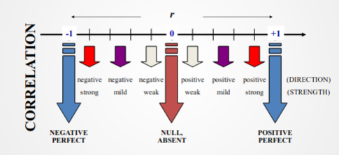
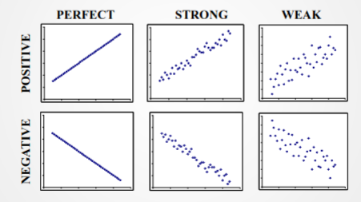
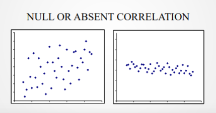

# Correlações

variables that are related to one another

correlation analysis is a way to analise the 
relationship between two or more variables. The 
goal is to quantify and assess whether:

* The relation is direct or inverse
* strong or weak

**Correlation doesn't imply causation**

Its possible to analyze this behavior by ploting 
the points into a cartesia  system, which allow a quick
overview of the data by the two variables.

## Pearson Correlation 

Quantifies the correlation amongst variables

$r$ between variables $X$ and $Y$ is given by 

$$r = \frac{Conv(X,Y)}{\sqrt{S^{2}_{x} \times S^{2}_{y}}}$$

*$r$ is bounded in $[-1,+1]$*

### Understanding pearsons coefficient

### Visual Analysis

### Formal deifnition

$r$ modulus: 

* $|r| \lt 0.4 \equiv$ Weak correlation
* $0.4 \leq |r| \lt 0.7 \equiv$ Mild correlation
* $0.7 \leq |r| \equiv$ strong correlation

## Spearmans Correlation

Should be used when

* Normality assumptions are not met, or
* whe have ordnial data

Spearman's $\rho$ (rhô)

* elements are sorted from the most positive to the most negative
* $\rho$ is computed using Pearson's equation, taking into account the ranking of each observation

## Correlation between categorical variables

### Cross-tabulating

a simple approach to check the behavior of categorical variables is to use corss-tables (contingency tables)

Using **pd.crosstab** and **heatmaps** allow us to quickly identify interesting behavior in data

## Multicolinearity

Problem that arrises when multiple variables are correlated to one another. If we use all of them when creating machine learning models, it will, be biased towards the same information. Somoe exceptions existe, e.g., Random Forest

Variable Inflation Factor (VIF), determines how explained a variable is given other covariates.

VIF can be computed as follows:

$$V.I.F. = \frac{1}{\Sigma (1-R^{2})}$$

* $VIF$ starts at $1$ and has no limit
* $VIF=1$ means that there is no correlation between this variable and other variables
* $VIF$ higher than $5$ usually depicts multicolinearity
* $VIF$ should be used iteratively: compute $VIF$, remove the variable woth the highest $VIF$, stop if no $VIF$ is above $5$

## Correlation and causation

several times, we will observe a correlation and assume that one variable is leading the other. This may be true, but not necessarily
